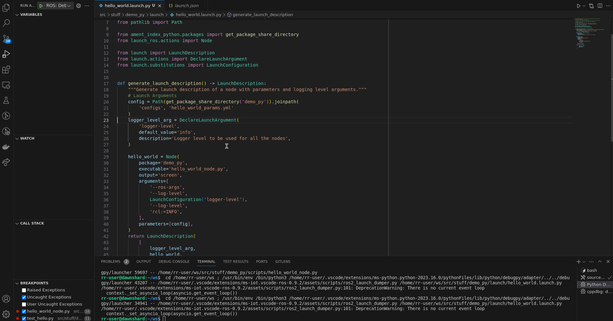
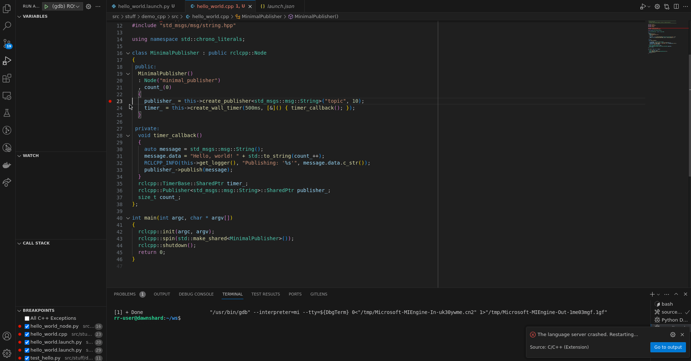
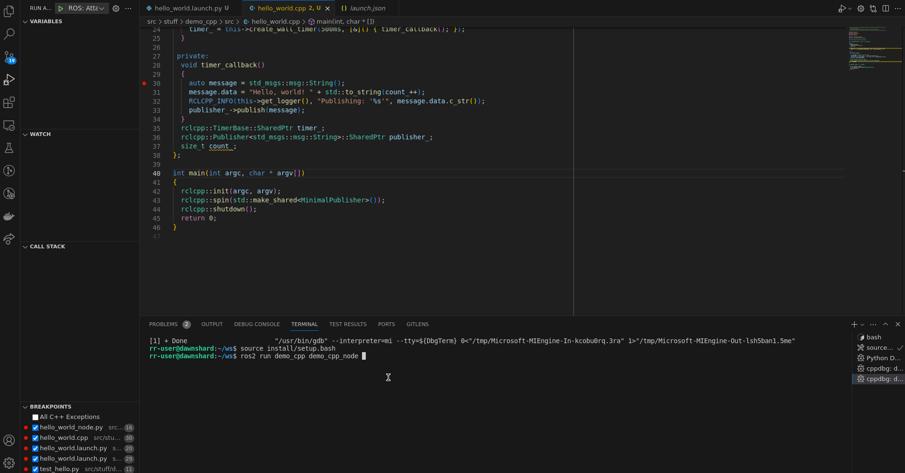
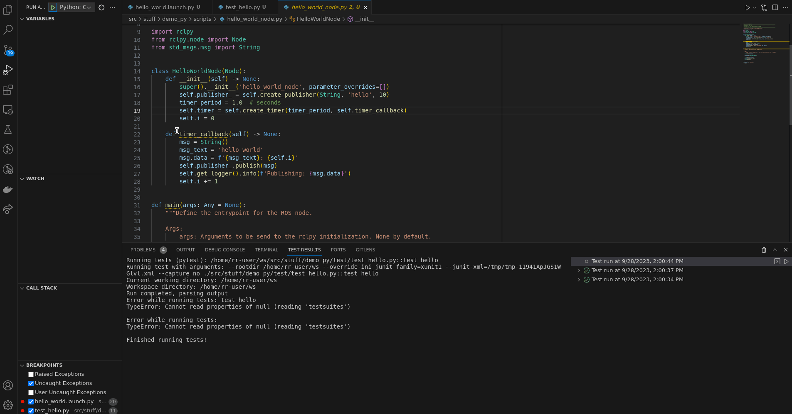

# ROS 2 with vscode

VSCode setup to work with ROS 2 Humble in Ubuntu 22.04.

This configuration can be used to develop ROS components in

- C++
- Python

The configuration here provided can be used as follows:

- Copy the [.vscode](./.vscode) directory to the directory where you wish to work on
- Take the pieces of the configuration here provided to your already active directory

## System requirements

- clang
- clang-tidy
- clang-format
- gdb
- black

## Recommended Extensions

### General Extensions

- [doi.fileheadercomment](https://marketplace.visualstudio.com/items?itemName=doi.fileheadercomment)
- [eamodio.gitLens](https://marketplace.visualstudio.com/items?itemName=eamodio.gitlens)
- [ms-azuretools.vscode-docker](https://marketplace.visualstudio.com/items?itemName=ms-azuretools.vscode-docker)
- [ms-iot.vscode-ros](https://marketplace.visualstudio.com/items?itemName=ms-iot.vscode-ros)
- [ms-vscode-remote.remote-containers](https://marketplace.visualstudio.com/items?itemName=ms-vscode-remote.remote-containers)
- [ms-vscode-remote.remote-ssh](https://marketplace.visualstudio.com/items?itemName=ms-vscode-remote.remote-ssh)
- [ms-vscode.remote-explorer](https://marketplace.visualstudio.com/items?itemName=ms-vscode.remote-explorer)
- [ms-vscode.test-adapter-converter](https://marketplace.visualstudio.com/items?itemName=ms-vscode.test-adapter-converter)
- [ms-vsliveshare.vsliveshare](https://marketplace.visualstudio.com/items?itemName=MS-vsliveshare.vsliveshare)
- [njpwerner.autoDocstring](https://marketplace.visualstudio.com/items?itemName=njpwerner.autodocstring)
- [shardulm94.trailing-spaces](https://marketplace.visualstudio.com/items?itemName=shardulm94.trailing-spaces)
- [smilerobotics.urdf](https://marketplace.visualstudio.com/items?itemName=smilerobotics.urdf)
- [yzhang.markdown-all-in-one](https://marketplace.visualstudio.com/items?itemName=yzhang.markdown-all-in-one)

To install the recommended extensions do `cat general_extensions.txt | xargs -I {} code --install-extension {}`

### C++ Extensions

- [jeff-hykin.better-cpp-syntax](https://marketplace.visualstudio.com/items?itemName=jeff-hykin.better-cpp-syntax)
- [josetr.cmake-language-support-vscode](https://marketplace.visualstudio.com/items?itemName=josetr.cmake-language-support-vscode)
- [ms-vscode.cmake-tools](https://marketplace.visualstudio.com/items?itemName=ms-vscode.cmake-tools)
- [ms-vscode.cpptools](https://marketplace.visualstudio.com/items?itemName=ms-vscode.cpptools)

To install the recommended extensions do `cat cpp_extensions.txt | xargs -I {} code --install-extension {}`

### Python Extensions

- [charliermarsh.ruff](https://marketplace.visualstudio.com/items?itemName=charliermarsh.ruff)
- [ms-python.python](https://marketplace.visualstudio.com/items?itemName=ms-python.python)
- [ms-python.vscode-pylance](https://marketplace.visualstudio.com/items?itemName=ms-python.vscode-pylance)
- [ms-toolsai.jupyter](https://marketplace.visualstudio.com/items?itemName=ms-toolsai.jupyter)
- [ms-toolsai.jupyter-keymap](https://marketplace.visualstudio.com/items?itemName=ms-toolsai.jupyter-keymap)
- [ms-toolsai.jupyter-renderers](https://marketplace.visualstudio.com/items?itemName=ms-toolsai.jupyter-renderers)
- [ms-toolsai.vscode-jupyter-cell-tags](https://marketplace.visualstudio.com/items?itemName=ms-toolsai.vscode-jupyter-cell-tags)

To install the recommended extensions do `cat python_extensions.txt | xargs -I {} code --install-extension {}`

## Settings

Here are the settings that you should have in VSCode to get the most out of it.

The complete settings can be found in [.vscode/settings.json](.vscode/settings.json)

### General Settings

```json
{
  "editor.tabSize": 2,
  "editor.rulers": [100],
  "ros.distro": "humble",
  "search.exclude": {
    "**/build": true,
    "**/install": true,
    "**/log": true
  }
}
```

These will do the following:

- Use 2 spaces whenever you press tab
- Add a visible ruler at 100 characters (encourage proper line length)
- Exclude directories for searching (Otherwise you get polluted results)

### Cpp Settings

```json
{
  "C_Cpp.codeAnalysis.clangTidy.enabled": true,
  "[cpp]": {
    "editor.defaultFormatter": "xaver.clang-format"
  }
}
```

Regarding the settings for C++. They do the following:

- Enable clang-format as the formatter for C++ files.
  - You can format a file by either right click->Format document or `Ctrl+Shift+I`
  - It is also possible for you to configure vscode to format every time you save. Simply add `        "editor.formatOnSave": true` to your `settings.json`
  - **Note**: It requires a `.clang-format` config file
- Enable clang-tidy code analysis. This ensures that clang-tidy is executed on the currently open file every time you save your changes.

  - **Note:** It requires a `.clang-tidy` config file, as well as a `compile_commands.json` file.

- A `.vscode/c_cpp_properties.json` file is also required

```json
{
  "configurations": [
    {
      "name": "Linux",
      "includePath": [
        "${workspaceFolder}/**",
        "/opt/ros/humble/include/**",
        "/usr/include/**"
      ],
      "defines": [],
      "intelliSenseMode": "gcc-x64",
      "compilerPath": "/usr/bin/gcc",
      "cStandard": "c11",
      "cppStandard": "c++17",
      "compileCommands": "${workspaceFolder}/build/compile_commands.json"
    }
  ],
  "version": 4
}
```

The configurations entered in the `c_cpp_properties.json` do the following:

- Path where to find for code definitions. This is consumed by Intellisense to better find includes in the source code.
- Specify the compiler used by intellisense (Language Server)
- Specify path to the compiler
- Version of C and C++ to be used
- Path to the `compile_commands.json` file.

### Python Settings

```json
    "python.autoComplete.extraPaths": [
        "/opt/ros/humble/lib/python3.10/site-packages/"
    ],
    "python.envFile": "${workspaceFolder}/.env",
    "python.analysis.extraPaths": [
        "/opt/ros/humble/lib/python3.10/site-packages/"
    ],
    "python.analysis.typeCheckingMode": "basic",
    "python.formatting.provider": "black"
```

These settings will do the following:

- Communicate Pylance where to get additional information for code analysis and auto completion
- Path to `.env` file where additional environmental variables can be entered
- Code analysis mode (**Info**: stric is too pedantic)
    - VsCode will use both Pylance and Ruff to lint your code every time you save
- Set `black` as code formatter
  - You can format a file by either right click->Format document or `Ctrl+Shift+I`
  - It is also possible for you to configure vscode to format every time you save. Simply add `        "editor.formatOnSave": true` to your `settings.json`

## Tasks

These tasks can be used to work with a ROS 2 to compile and test the complete
workspace or individual packages.

Note that it expects the following inputs to query the user for some more input data

```json
{
  "inputs": [
    {
      "id": "package",
      "type": "promptString",
      "description": "Package name",
      "default": "demo_nodes_cpp"
    }
  ]
}
```

The complete tasks configurations can be found in [.vscode/tasks.json](.vscode/tasks.json)

### build workspace

```json
{
  "tasks": [
    {
      "label": "build workspace",
      "detail": "Build ROS 2 workspace",
      "type": "shell",
      "command": "colcon build --symlink-install --cmake-args -DCMAKE_EXPORT_COMPILE_COMMANDS=ON",
      "group": {
        "kind": "build",
        "isDefault": true
      },
      "problemMatcher": "$gcc"
    }
  ]
}
```

Builds workspace as `symlink-install` and generates the `compile_commands.json`.

### build pedantic release

```json
{
  "tasks": [
    {
      "label": "build pedantic release",
      "detail": "Build workspace with release info and with all warnings enabled",
      "type": "shell",
      "command": "colcon build --symlink-install --cmake-args '-DCMAKE_BUILD_TYPE=RelWithDebInfo' '-DCMAKE_EXPORT_COMPILE_COMMANDS=On' -Wall -Wextra -Wpedantic",
      "group": {
        "kind": "build",
        "isDefault": true
      },
      "problemMatcher": "$gcc"
    }
  ]
}
```

Builds workspace as `symlink-install` with release info and all warnings enabled.

### build single package

```json
{
  "tasks": [
    {
      "label": "build single package",
      "detail": "Build single ROS 2 package",
      "type": "shell",
      "command": "colcon build --symlink-install --packages-select ${input:package} --cmake-args '-DCMAKE_EXPORT_COMPILE_COMMANDS=On'",
      "group": {
        "kind": "build",
        "isDefault": true
      },
      "problemMatcher": "$gcc"
    }
  ]
}
```

Builds a single ROS package (prompt the user for the name) as `symlink-install`
and generates the `compile_commands.json`

### debug workspace

```json
{
  "tasks": [
    {
      "label": "debug workspace",
      "detail": "Build ROS 2 workspace with debug symbols",
      "type": "shell",
      "command": "colcon build --symlink-install  --cmake-args '-DCMAKE_BUILD_TYPE=Debug'",
      "group": "build",
      "problemMatcher": "$gcc"
    }
  ]
}
```

Builds workspace as `symlink-install` with debug symbols

### debug single package

```json
{
  "tasks": [
    {
      "label": "debug single package",
      "detail": "Build single ROS 2 package with debug symbols",
      "type": "shell",
      "command": "colcon build --symlink-install --packages-select ${input:package} --cmake-args '-DCMAKE_BUILD_TYPE=Debug'",
      "group": "build",
      "problemMatcher": "$gcc"
    }
  ]
}
```

Builds a single ROS package (prompt the user for the name) as `symlink-install`
with debug symbols

### source-humble

```json
{
  "tasks": [
    {
      "label": "source-humble",
      "detail": "Sources the current workspace with bash shell",
      "type": "shell",
      "command": "source ${workspaceFolder}/install/setup.bash && printenv > ${workspaceFolder}/local_humble_ws.env",
      "group": {
        "kind": "build",
        "isDefault": true
      },
      "problemMatcher": "$gcc"
    }
  ]
}
```

Helper task that can be used for certain launch configurations to source the ROS workspace.

### test workspace

```json
{
  "tasks": [
    {
      "label": "test workspace",
      "detail": "Run all unit tests and show results.",
      "type": "shell",
      "command": "colcon test && colcon test-result --all",
      "group": {
        "kind": "test",
        "isDefault": true
      }
    }
  ]
}
```

Runs `colcon test` and display the results file.

### ament_cpplint

```json
{
  "label": "ament_cpplint current file",
  "detail": "Lint the currently open file with cpplint.",
  "type": "shell",
  "command": "ament_cpplint ${relativeFile}",
  "presentation": {
    "panel": "dedicated",
    "reveal": "silent",
    "clear": true
  },
  "problemMatcher": [
    {
      "owner": "cpplint",
      "source": " cpplint",
      "fileLocation": "absolute",
      "pattern": [
        {
          "regexp": "^(.+):(\\d+):\\s+(.+)\\[(.+)\\]$",
          "file": 1,
          "line": 2,
          "message": 3,
          "code": 4
        }
      ]
    }
  ]
}
```

Runs `ament_cpplint` in the current open file and propagates the errors to VSCode
problem matcher.

### ament_cppcheck

```json
{
  "label": "ament_cppcheck current file",
  "detail": "Run static code checker cppcheck on the currently opened file.",
  "type": "shell",
  "command": "ament_cppcheck ${relativeFile}",
  "presentation": {
    "panel": "dedicated",
    "reveal": "silent",
    "clear": true
  },
  "problemMatcher": [
    {
      "owner": "cppcheck",
      "source": "cppcheck",
      "pattern": [
        {
          "regexp": "^\\[(.+):(\\d+)\\]:\\s+(.+)$",
          "file": 1,
          "line": 2,
          "message": 3
        }
      ]
    }
  ]
}
```

Runs `ament_cppcheck` in the current open file and propagates the errors to VSCode
problem matcher.

## Launch configurations (Debugging)

The complete launch configurations can be found in [.vscode/launch.json](.vscode/launch.json)

### Launch Files Configurations

#### ROS 2 Launch file

```json
{
    "name": "ROS: Debug launch",
    "type": "ros",
    "request": "debug_launch",
    "target": "${file}"
},
```

Spawns a Python debugger in the current ROS 2 launch file.



### ROS 2 Launch Test

```json
{
  "name": "Python: ROS 2 launch test",
  "type": "python",
  "request": "launch",
  "preLaunchTask": "source-humble",
  "envFile": "${workspaceFolder}/local_humble_ws.env",
  "program": "/opt/ros/humble/bin/launch_test",
  "args": ["${file}"],
  "console": "integratedTerminal"
}
```

Spawns a Python debugger in the current ROS 2 launch test file that use `unitttest`
framework. This launch configuration uses the `launch_test` executable from ROS
and it takes care of sourcing the local workspace.

**NOTE:** When you want to debug a ROS 2 launch test that uses
[launch_pytest](https://github.com/ros2/launch/tree/rolling/launch_pytest) instead,
you can either use [vscode testing extension](https://code.visualstudio.com/api/working-with-extensions/testing-extension)
or add a main to your file and use [Python Launch Configuration](#python-current-file)

### Cpp Configurations

- To attach to a running process, it is required to do the following.
  - `sudo vim /etc/sysctl.d/10-ptrace.conf`
  - Add (or change value to) `kernel.yama.ptrace_scope = 0`
- For further details see [vscode cpp debuging](https://code.visualstudio.com/docs/cpp/cpp-debug#_debugging)
- Also, remember to build the package you wish to debug with the debug symbols `--cmake-args  -DCMAKE_BUILD_TYPE=Debug`

#### ROS 2 CPP Node

```json
{
    "name": "ROS 2 CPP Node",
    "type": "cppdbg",
    "request": "launch",
    "program": "${workspaceFolder}/install/${input:package}/lib/${input:package}/${input:program}",
    "args": [],
    "preLaunchTask": "source-humble",
    "envFile": "${workspaceFolder}/local_humble_ws.env",
    "stopAtEntry": true,
    "cwd": "${workspaceFolder}",
    "externalConsole": false,
    "MIMode": "gdb",
    "setupCommands": [
      {
        "description": "Enable pretty-printing for gdb",
        "text": "-enable-pretty-printing",
        "ignoreFailures": true
      }
    ]
},
```

Spawns a ROS 2 node using `cppdbg` with the current workspace sourced. It asks
the user for the ROS package and the ROS node that should be spawned.



#### ROS Attach

```json
{
    "name": "ROS: Attach",
    "type": "ros",
    "request": "attach"
},
```

Prompt the user to select the Node type as well as the Process to which the debugger
should be attached to. **Note:** It requires having ptrace properly configure.



### Python Configurations

#### Python: Current File

```json
{
    "name": "Python: Current File",
    "type": "python",
    "request": "launch",
    "program": "${file}",
    "console": "integratedTerminal"
},
```



Spawns debugpy in the current file and stop at any given breakpoints.

#### ROS 2 Current File

```json
{
    "name": "Python: ROS 2 current file",
    "type": "python",
    "preLaunchTask": "source-humble",
    "envFile": "${workspaceFolder}/local_humble_ws.env",
    "request": "launch",
    "program": "${file}",
    "console": "integratedTerminal"
},
```

Very similar to the configuration before, but it loads the ROS 2 workspace
environment beforehand.

## Devcontainer

- For using a [vscode development container](https://code.visualstudio.com/docs/remote/containers):
  I recommend the following resources:
  - [athackst/vscode_ros2_workspace](https://github.com/athackst/vscode_ros2_workspace):
    Template repository
  - [erickkramer/vscode_ros2_workspace (template)](https://github.com/ErickKramer/vscode_ros2_workspace):
    Extension of the previous repository with the addition of ssh credential
    injection and the extensions enlisted above
